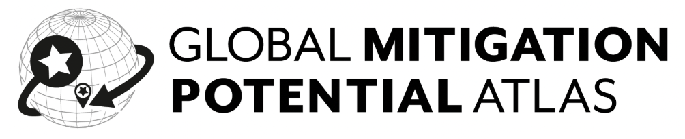
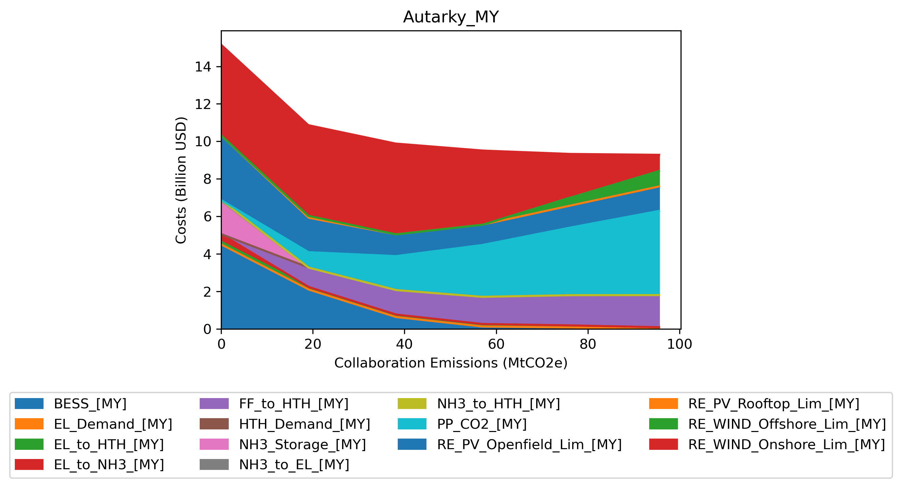

# GMPA - STEVFNs modelling


This is the STEVFNs model generator branch containing modelling details for the GMPA. For the general details of the model generator and how to install, see main. To run case studies in this branch, you need to clone the STEVFNs repository as instructed and fetch all remote branches. You will then be able to pull GMPA branch and have a local version of it to work with. 


## Workflow

> [!NOTE]
> The workflow detailed below relates to case study creation and running the model; it assumes that all data inputs for assets (costs, renewable energy profiles, etc.) have been already been created. It also assumes that the countries we are modelling for are already in the Location Parameters, and that the scenarios for said countries in baseline case studies have been created. Comprehensive documentation of how this is done will be prepared for upcoming phases of the project.

### 1. Run baseline case studies
The assumptions for GMPA at its latest stage use a BAU and Least Cost baseline to generate a specific country's emissions reduction profile. In STEVFNs/Data/Case_Study there will be two folders named BAU_No_Action and Least_Cost_Emissions. In these, scenario folders for the countries currently covered in GMPA can be found. By running BAU and LC, we obtain the emissions data to create 11 scenarios of emissions reduction towards 0 MtCO<sub>2</sub>e

The python wrapper, run_cases.py has been created to run main.py through CLI commands and not edit this script to avoid conflicts when several people are working on the modelling.

To run the baseline case studies, BAU_No_Action and Least_Cost_Emissions:

1. In terminal, navigate to your local STEVFNs folder
2. Run conda activate your_env_name to ensure you're in the environment with required dependencies
3. Run the following commands (wait until one case study ends to run the next)
(a) for BAU_No_Action
```
python run_cases.py bau
```
(b) for Least_Cost_Emissions
```
python run_cases.py least
```

There is a solver flag included in the wrapper to manually define which solver the model will use to optimise each case study. The default if none is specified is CLARABEL, and the wrapper currently works only with MOSEK and CLARABEL, as we have gotten good results in terms of run times with these solvers.

Running these two case studies will have created total_data_unrounded.csv and total_data.csv inside the case study folders, which will be used to create the emission reduction profiles in step 2. 

### 2. Create emissions reduction profiles
Based on the BAU (assumes a more limited technology mix) and Least cost (assumes extensive technology mix including e.g. short term and long term storage) emissions, we need to create the "carbon budget" scenarios. We model 11 scenarios from the baseline to 0 for all case studies. These can be calculated through STEVFNs/Code/Automations/generate_carbon_budget.py script.

To run:
* In the terminal, navigate to STEVFNs/Code/Automations, and run
```
python generate_carbon_budget.py
```
* This will automatically create a budget profile or update existing values for single countries based on the most recent total_data files in BAU and Least_Cost. 
* It will then prompt the user to answer whether collaboration emissions should also be created. If yes, enter "y" and click return
* The user will be prompted to enter a comma-separated list of 2-4 countries with a small example. If the collaborations between Germany, France, Turkey and Morocco are desired to be modelled, the user should enter the two-letter ISO abbreviations as:
```
DE,FR,TR,MA
```
This will create all the possible collaborations between these countries, which will be printed in the terminal. The CO2_Budget profile should also be saved in STEVFNs/Code/Assets/CO2_Budget/parameters.csv file.

> [!NOTE] 
> To create collaboration emissions reduction profiles, the individual countries' emissions should have been calculated in BAU_No_Action and Least_Cost_Emissions case studies. 

### 3. Update CO2_Budget Asset type in Asset_Parameters.csv

Each scenario in the case studies has an Asset_Parameters.csv to define which asset data to use for each country and scenario modelled. The CO2_Budget values that are created in step 2 need to be updated in the single country and multi-country case study folders/scenario folder/Asset_Paramters.csv.

* In the terminal, navigate to STEVFNs/Code/Automations, and run
```
python update_co2_budget_asset_types.py
```

### 4. Create collaboration case study folders
> [!NOTE] 
> To create the case study folders for multiple countries, both in autarky and collaboration formats, the CO<sub>2</sub> budget for those collaborations must have already been created. If they have not, the user must re-run generate_carbon_budget.py, allow for all single country values to be updated and say yes when prompted to create for a collaboration.

To follow on the example of modelling the possible combinations of Germany, France, Turkey and Morocco done in step 2:

* In the terminal, navigate to STEVFNs/Code/Automations, and run
```
python generate_collab_case_studies.py . DE FR TR MA
```
Note that in this case, the list is only separated by spaces. The order does not matter, the script will automatically be created with alphabetical combinations as a convention.

For this command to work as written, user needs to be in local/path/to/STEVFNs/Code/Automations. Otherwise, the script will display the usage instructions in your terminal/console, which show
```
python generate_collab_case_studies.py <root_dir> [DE FR TR ...]
```
If in another folder, the user may type out the path to the Automations folder in place of `<root_dir>` and the list of countries afterwards (no need for brackets).
 
### 5. Run case studies


#### To run single country case studies
Single country case studies, where the naming convention of the case study folder is Autarky_XX with XX being the two-letter ISO code, can be run with the following command example to run Germany with mosek as the solver
```
python run_cases.py DE --solver mosek
```

#### To run multiple country case studies
Collaborations and their autarky comparison (e.g. WW-XX-YY_Autarky and WW-XX-YY_Collab) can be run with a slightly different command. You will need to enter the four-country list of countries that will be collaborating. In Steps 2 and 4, you should have created all the collaboration emissions profile and case study folders through a different helper script. In the example above, we created them for DE, FR, TR, MA. To run all case studies from this combination (i.e. the two-, three- and four-country combinations in a loop), run the following command

```
python run_cases.py DE FR TR MA
```
This will solve all of them with CLARABEL, if you wish to use MOSEK, specify with the --solver flag.

> [!TIP]
> As the number of assets in a network increases, so does the build and sovle time of the problem. The current version of GMPA samples only 720 hours of a year to allow for quick solves. Increasing the sample size will impact running times. A few estimates of how long it should take for 720 hours:
> Using CLI to run python main.py with few other applications using memory at the same time, 
>       1. Single country case studies should take under 2 minutes to solve all 11 scenarios
>       2. Two countries without collaboration should take under 5 minutes to solve all 11 scenarios
>       3. Four countries collaborating should take around 11 minutes to solve all 11 scenarios

Therefore, to run all comabinations of a set of four countries, it should take about two hours to finish, as it will have to run 16 case studies all together.

The results should be reviewed to confirm whether or not a specific case study should be run again. In these cases, there may be times where a specific three country combination needs to be run again with MOSEK instead of CLARABEL, for example. Please see the table below for example commands depending on the situation

| Command                                       | What it does                                            |
| --------------------------------------------- | ---------------------------------------------           |
| `python run_cases.py DE`                      | Runs only `Autarky_DE`                                  |
| `python run_cases.py bau`                     | Runs BAU\_No\_Action                                    |
| `python run_cases.py DE FR --solver mosek`    | Runs DE-FR\_Autarky and DE-FR\_Collab with MOSEK solver |
| `python run_cases.py DE FR MA TR`             | Runs all 2-, 3-, and 4-country combinations             |
| `python run_cases.py DE FR MA TR --sub`       | Runs only `DE-FR-MA-TR_Autarky` and `_Collab`           |


### 6. Review results 
Running main.py will save a mitigation plot in the case study folder, along with other result files. The mitigation plot should look something like this: 


Systems cost decrease with higher emissions values, and they tend to have an "elbow" when approaching zero emissions (going left on the X-axis), as costs increase more rapidly when investment is needed in more expensive technologies to completely decarbonise the system modelled.
If the result plot looks off, e.g. has an unexpected "_dip_" or "_peak_", this is likely due to the solver used. On occasion, CLARABEL will find an optimal solution for one of the emissions reduction scenarios that creates these anomalies. This is likely due to a flatter objective function curve. We have seen this be fixed by changing the solver to MOSEK.

MOSEK requires to be installed and a user license, and can be downloaded at [MOSEK Downloads](https://www.mosek.com/downloads/), a trial or personal academic license may be requested through [License Request](https://www.mosek.com/license/request/).

Please contact Aniq or Mónica with any issues.

If the results are sensible, they should be consolidated and formatted for web upload once all relevant case studies have been run. 

### 7. Preparing results for webtool

Once all the required case studies have been run and have total_data_unrounded.csv result files, all results can be compiled and processed for upload by running the STEVFNs/Code/Automations/prepare_data_for_website.py script. Simply run it through an IDE, or through terminal, once in the Automations folder:
```
python prepare_data_for_website.py
```
This will create files and a folder in the STEVFNs/Code/Results/Results_for_Website folder.
All files in the /To_Upload folder here are needed for the results to display in the webtool. 

