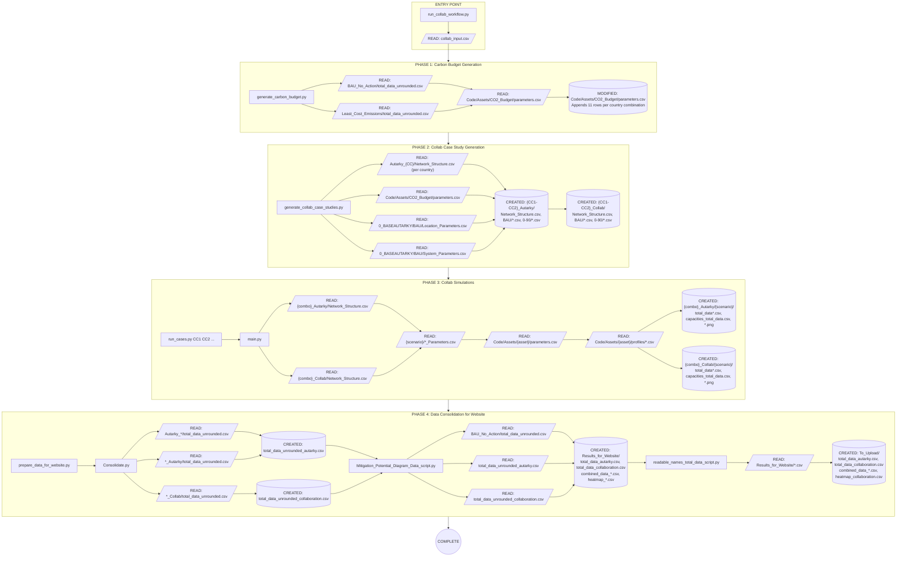

# STEVFNs: Add Collaboration Workflow

## Overview Flowchart

---

## Script Dependency Chain

```mermaid
flowchart LR
    S1[run_collab_workflow.py] --> S2[generate_carbon_budget.py]
    S2 --> S3[generate_collab_case_studies.py]
    S3 --> S4[run_cases.py CC1 CC2 ...]
    S4 --> S5[main.py]
    S5 --> S6[prepare_data_for_website.py]
    S6 --> S7[Consolidate.py]
    S7 --> S8[Mitigation_Potential_Diagram_Data_script.py]
    S8 --> S9[readable_names_total_data_script.py]
```

---

## Detailed Phase Descriptions

### Phase 1: Carbon Budget Generation

**Script:** `Code/Automations/generate_carbon_budget.py`

| Operation | File |
|-----------|------|
| READ | `Data/Case_Study/BAU_No_Action/total_data_unrounded.csv` |
| READ | `Data/Case_Study/Least_Cost_Emissions/total_data_unrounded.csv` |
| READ | `Code/Assets/CO2_Budget/parameters.csv` |
| MODIFIED | `Code/Assets/CO2_Budget/parameters.csv` |

**What it does:**
- Extracts first emission row for each country from BAU and Least Cost results
- For collaboration combinations (e.g., `ID,SG`), generates all sub-combinations (2 to N countries)
- Calculates CO2 budget parameters with factors 0.0 to 1.0 (11 values)
- Appends rows to CO2_Budget parameters.csv with `case_study` format: `CC1-CC2-CC3` (sorted, hyphen-separated)
- Updates existing case studies if they already exist in parameters.csv

**Carbon Budget Calculation:**
- `sum_bau_30` = Sum of BAU emissions for all countries in combo × 30
- `sum_lc_30` = Sum of Least Cost emissions for all countries in combo × 30
- Values ≤ `sum_lc_30` are kept as-is
- Values > `sum_lc_30` are interpolated to reach `sum_lc_30`

---

### Phase 2: Collab Case Study Generation

**Script:** `Code/Automations/generate_collab_case_studies.py`

| Operation | File |
|-----------|------|
| READ | `Data/Case_Study/Autarky_{CC}/Network_Structure.csv` (for each country) |
| READ | `Code/Assets/CO2_Budget/parameters.csv` |
| READ | `Data/Case_Study/0_BASEAUTARKY/BAU/Location_Parameters.csv` |
| READ | `Data/Case_Study/0_BASEAUTARKY/BAU/System_Parameters.csv` |
| CREATED | `Data/Case_Study/{CC1-CC2}_Autarky/Network_Structure.csv` |
| CREATED | `Data/Case_Study/{CC1-CC2}_Autarky/BAU/*.csv` |
| CREATED | `Data/Case_Study/{CC1-CC2}_Autarky/{0-90}/*.csv` |
| CREATED | `Data/Case_Study/{CC1-CC2}_Collab/Network_Structure.csv` |
| CREATED | `Data/Case_Study/{CC1-CC2}_Collab/BAU/*.csv` |
| CREATED | `Data/Case_Study/{CC1-CC2}_Collab/{0-90}/*.csv` |

**What it does:**

1. **Discovers Autarky folders:** Finds all `Autarky_{CC}` folders in Case_Study directory
2. **Builds location map:** Extracts Location_1 from CO2_Budget row in each Network_Structure.csv
3. **For each country combination (2 to 4 countries):**

   **Creates `{CC1-CC2}_Autarky` folder:**
   - Union of Network_Structure.csv from all single-country Autarky folders
   - Keeps single CO2_Budget row (removes duplicates)
   - No transport assets added

   **Creates `{CC1-CC2}_Collab` folder:**
   - Same union of Network_Structure.csv
   - Adds transport assets between all country pairs:
     - `EL_Transport` (electricity transport)
     - `NH3_Transport` (ammonia transport with Period=96, Transport_Time=108)

4. **Copies static files to BAU folder:**
   - `Location_Parameters.csv` from `0_BASEAUTARKY/BAU/`
   - `System_Parameters.csv` from `0_BASEAUTARKY/BAU/`

5. **Builds Asset_Parameters.csv:**
   - `Asset_Type` = Location_1 for most assets
   - `Asset_Type` = 0 for transport assets
   - `Asset_Type` = CO2_Budget Type for CO2_Budget asset

6. **Creates reduction scenario folders (0, 10, 20, ..., 90):**
   - Copies static files from BAU
   - Increments CO2_Budget Asset_Type by offset (1 for scenario 0, 2 for scenario 10, etc.)

---

### Phase 3: Collab Simulations

**Scripts:** `run_cases.py CC1 CC2 ...` → `main.py`

| Operation | File |
|-----------|------|
| READ | `Data/Case_Study/{combo}_Autarky/Network_Structure.csv` |
| READ | `Data/Case_Study/{combo}_Collab/Network_Structure.csv` |
| READ | `Data/Case_Study/{case}/{scenario}/Asset_Parameters.csv` |
| READ | `Data/Case_Study/{case}/{scenario}/Location_Parameters.csv` |
| READ | `Data/Case_Study/{case}/{scenario}/System_Parameters.csv` |
| READ | `Code/Assets/{asset}/parameters.csv` |
| READ | `Code/Assets/{asset}/profiles/*.csv` |
| CREATED | `Data/Case_Study/{case}/{scenario}/total_data.csv` |
| CREATED | `Data/Case_Study/{case}/{scenario}/total_data_unrounded.csv` |
| CREATED | `Data/Case_Study/{case}/{scenario}/capacities_total_data.csv` |
| CREATED | `Data/Case_Study/{case}/{scenario}/internal_total_data.csv` |
| CREATED | `Data/Case_Study/{case}/{scenario}/dpacc_subplots.png` |
| CREATED | `Data/Case_Study/{case}/{scenario}/mitigation_curve.png` |

**What it does:**

**run_cases.py:**
- Takes 2-4 country codes as input
- Generates case study names using `generate_case_study_names()`:
  - For 2-3 countries: `{CC1-CC2}_Autarky`, `{CC1-CC2}_Collab`
  - For 4 countries: Full combination plus all sub-combinations (2 and 3 country combos)
- `--sub` flag: Only runs the specific combo provided (no sub-combinations)
- Sets environment variables: `CASE_STUDY_NAME`, `SOLVER_NAME`
- Runs main.py for each case study

**main.py:**
- Reads `Network_Structure.csv` to build network via `Network_STEVFNs.build()`
- For each scenario folder (BAU, 0, 10, 20, ..., 90):
  - Reads `Asset_Parameters.csv`, `Location_Parameters.csv`, `System_Parameters.csv`
  - Updates network parameters via `my_network.update()`
  - Solves optimization problem using CLARABEL or MOSEK solver
  - Generates output files via `GMPA_Results`

---

### Phase 4: Data Consolidation for Website

**Script:** `Code/Automations/prepare_data_for_website.py`

#### Step 4A: Consolidate.py

| Operation | File |
|-----------|------|
| READ | `Data/Case_Study/Autarky_*/total_data_unrounded.csv` |
| READ | `Data/Case_Study/*_Autarky/total_data_unrounded.csv` |
| READ | `Data/Case_Study/*_Collab/total_data_unrounded.csv` |
| CREATED | `Data/Case_Study/total_data_unrounded_autarky.csv` |
| CREATED | `Data/Case_Study/total_data_unrounded_collaboration.csv` |

**What it does:**
- Scans Case_Study directory for all Autarky and Collab folders
- Concatenates all `total_data_unrounded.csv` files:
  - Autarky data: `Autarky_*` and `*_Autarky` folders
  - Collaboration data: `Autarky_*` and `*_Collab` folders

#### Step 4B: Mitigation_Potential_Diagram_Data_script.py

| Operation | File |
|-----------|------|
| READ | `Data/Case_Study/BAU_No_Action/total_data_unrounded.csv` |
| READ | `Data/Case_Study/total_data_unrounded_autarky.csv` |
| READ | `Data/Case_Study/total_data_unrounded_collaboration.csv` |
| CREATED | `Code/Results/Results_for_Website/total_data_autarky.csv` |
| CREATED | `Code/Results/Results_for_Website/total_data_collaboration.csv` |
| CREATED | `Code/Results/Results_for_Website/combined_data_autarky.csv` |
| CREATED | `Code/Results/Results_for_Website/combined_data_collaboration.csv` |
| CREATED | `Code/Results/Results_for_Website/heatmap_autarky.csv` |
| CREATED | `Code/Results/Results_for_Website/heatmap_collaboration.csv` |

**What it does:**
- `generate_combined_df()`: Calculates marginal and average abatement costs
  - Groups by country combinations (country_1, country_2, country_3, country_4)
  - Computes costs relative to BAU baseline
  - Units: $/tCO2e (converted from k$/tCO2e × 1000)

- `generate_heatmap_df()`: Calculates mitigation potential at cost cutoffs
  - Marginal cutoffs: [0, 50, 100, 200] $/tCO2e
  - Average cutoffs: [0, 10, 20, 50] $/tCO2e
  - Outputs mitigation potential (MtCO2e) at each cutoff

- `generate_data_for_website()`: Filters columns for website display

#### Step 4C: Copy + readable_names_total_data_script.py

| Operation | File |
|-----------|------|
| READ | `Code/Results/Results_for_Website/*.csv` |
| CREATED | `Code/Results/Results_for_Website/To_Upload/total_data_autarky.csv` |
| CREATED | `Code/Results/Results_for_Website/To_Upload/total_data_collaboration.csv` |
| CREATED | `Code/Results/Results_for_Website/To_Upload/combined_data_autarky.csv` |
| CREATED | `Code/Results/Results_for_Website/To_Upload/combined_data_collaboration.csv` |
| CREATED | `Code/Results/Results_for_Website/To_Upload/heatmap_collaboration.csv` |

**What it does:**
- Copies files from `Results_for_Website/` to `To_Upload/`
- Transforms technology codes to human-readable names

---

## Technology Name Mappings (Phase 4C)

| Original Name | Readable Name |
|--------------|---------------|
| `RE_PV_Rooftop_Lim_[XX]` | Rooftop PV [XX] |
| `RE_PV_Openfield_Lim_[XX]` | Openfield PV [XX] |
| `RE_WIND_Offshore_Lim_[XX]` | Offshore wind [XX] |
| `RE_WIND_Onshore_Lim_[XX]` | Onshore wind [XX] |
| `PP_CO2_[XX]` | Fossil fuel powerplant [XX] |
| `BESS_[XX]` | Battery storage [XX] |
| `EL_to_HTH_[XX]` | Electric High Temp. Heating [XX] |
| `EL_to_NH3_[XX]` | Electricity to Ammonia [XX] |
| `NH3_Storage_[XX]` | Ammonia storage [XX] |
| `NH3_to_EL_[XX]` | Ammonia to electricity [XX] |
| `NH3_to_HTH_[XX]` | Ammonia High Temp. Heating [XX] |
| `FF_to_HTH_[XX]` | Fossil High Temp. Heating [XX] |
| `HYDRO_[XX]` | Hydropower [XX] |
| `EL_Transport_[XX-YY]` | HVDC Cables [XX-YY] |
| `NH3_Transport_[XX-YY]` | Ammonia Transport [XX-YY] |

---

## Complete File Operations Summary

| Phase | Script | File | READ | MODIFIED | CREATED |
|-------|--------|------|:----:|:--------:|:-------:|
| **Entry** | run_collab_workflow.py | `collab_input.csv` | X | | |
| **1** | generate_carbon_budget.py | `BAU_No_Action/total_data_unrounded.csv` | X | | |
| **1** | generate_carbon_budget.py | `Least_Cost_Emissions/total_data_unrounded.csv` | X | | |
| **1** | generate_carbon_budget.py | `Code/Assets/CO2_Budget/parameters.csv` | X | X | |
| **2** | generate_collab_case_studies.py | `Autarky_{CC}/Network_Structure.csv` | X | | |
| **2** | generate_collab_case_studies.py | `Code/Assets/CO2_Budget/parameters.csv` | X | | |
| **2** | generate_collab_case_studies.py | `0_BASEAUTARKY/BAU/Location_Parameters.csv` | X | | |
| **2** | generate_collab_case_studies.py | `0_BASEAUTARKY/BAU/System_Parameters.csv` | X | | |
| **2** | generate_collab_case_studies.py | `{combo}_Autarky/Network_Structure.csv` | | | X |
| **2** | generate_collab_case_studies.py | `{combo}_Autarky/BAU/*.csv` | | | X |
| **2** | generate_collab_case_studies.py | `{combo}_Autarky/{0-90}/*.csv` | | | X |
| **2** | generate_collab_case_studies.py | `{combo}_Collab/Network_Structure.csv` | | | X |
| **2** | generate_collab_case_studies.py | `{combo}_Collab/BAU/*.csv` | | | X |
| **2** | generate_collab_case_studies.py | `{combo}_Collab/{0-90}/*.csv` | | | X |
| **3** | run_cases.py | (orchestrates main.py) | | | |
| **3** | main.py | `{case}/Network_Structure.csv` | X | | |
| **3** | main.py | `{case}/{scenario}/*_Parameters.csv` | X | | |
| **3** | main.py | `Code/Assets/{asset}/parameters.csv` | X | | |
| **3** | main.py | `Code/Assets/{asset}/profiles/*.csv` | X | | |
| **3** | main.py | `{case}/{scenario}/total_data.csv` | | | X |
| **3** | main.py | `{case}/{scenario}/total_data_unrounded.csv` | | | X |
| **3** | main.py | `{case}/{scenario}/capacities_total_data.csv` | | | X |
| **3** | main.py | `{case}/{scenario}/internal_total_data.csv` | | | X |
| **3** | main.py | `{case}/{scenario}/*.png` | | | X |
| **4** | Consolidate.py | `Autarky_*/total_data_unrounded.csv` | X | | |
| **4** | Consolidate.py | `*_Autarky/total_data_unrounded.csv` | X | | |
| **4** | Consolidate.py | `*_Collab/total_data_unrounded.csv` | X | | |
| **4** | Consolidate.py | `total_data_unrounded_autarky.csv` | | | X |
| **4** | Consolidate.py | `total_data_unrounded_collaboration.csv` | | | X |
| **4** | Mitigation...py | `BAU_No_Action/total_data_unrounded.csv` | X | | |
| **4** | Mitigation...py | `total_data_unrounded_autarky.csv` | X | | |
| **4** | Mitigation...py | `total_data_unrounded_collaboration.csv` | X | | |
| **4** | Mitigation...py | `Results_for_Website/*.csv` | | | X |
| **4** | readable_names...py | `Results_for_Website/*.csv` | X | | |
| **4** | readable_names...py | `To_Upload/*.csv` | | | X |

---

## Key Differences from Add Country Workflow

| Aspect | Add Country | Add Collab |
|--------|-------------|------------|
| **Entry Point** | `add_country.py` | `run_collab_workflow.py` |
| **Input File** | `new_country_input.csv`, `new_country_assets_input.csv` | `collab_input.csv` (list of country combinations) |
| **Prerequisite** | None (adds new country from scratch) | Countries must already exist as `Autarky_{CC}` folders |
| **Carbon Budget** | Generated after initial BAU/Least Cost runs | Generated first (combines existing country budgets) |
| **Network Structure** | Created from template (JP) | Union of existing single-country networks |
| **Transport Assets** | None (single-country autarky) | EL_Transport + NH3_Transport between country pairs |
| **Case Study Naming** | `Autarky_{CC}` | `{CC1-CC2}_Autarky`, `{CC1-CC2}_Collab` |

---

## Key Dependencies Between Phases

1. **Phase 1 must complete first** - CO2_Budget parameters needed for case study generation
2. **Phase 2 depends on Phase 1** - Uses CO2_Budget Type IDs for Asset_Parameters
3. **Phase 2 requires existing Autarky_{CC} folders** - Cannot run collab without single-country data
4. **Phase 3 depends on Phase 2** - Simulations need case study folders to exist
5. **Phase 4 depends on Phase 3** - Website data consolidation needs all simulation results
6. **Phase 4 runs once at end** - Consolidates ALL results (not per-combination)

---

## Example: Running Collab for ID, SG, MY

**Input:** `collab_input.csv` containing: `ID,SG,MY`

**Case Studies Generated:**
- `ID-MY_Autarky`, `ID-MY_Collab`
- `ID-SG_Autarky`, `ID-SG_Collab`
- `MY-SG_Autarky`, `MY-SG_Collab`
- `ID-MY-SG_Autarky`, `ID-MY-SG_Collab`

**Transport Assets Added (Collab only):**
- For 2-country combos: 2 transport assets (EL + NH3)
- For 3-country combos: 6 transport assets (3 pairs × 2 asset types)

**Scenarios per Case Study:**
- BAU, 0, 10, 20, 30, 40, 50, 60, 70, 80, 90 (11 total)
