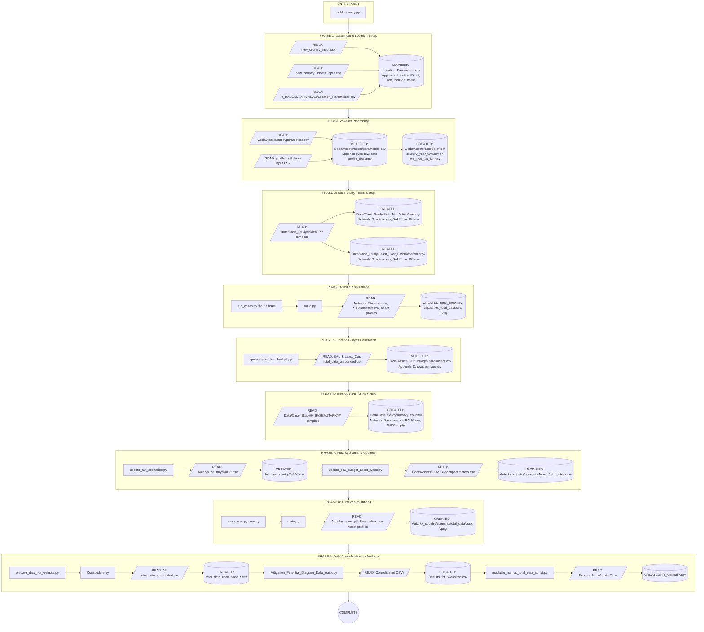

# STEVFNs: Add New Country Workflow

## Overview Flowchart

---

## Script Dependency Chain

---

## Detailed Phase Descriptions

### Phase 1: Data Input & Location Setup

**Function:** `add_new_country()` in `add_country.py`

| Operation | File |
|-----------|------|
| READ | `new_country_input.csv` |
| READ | `new_country_assets_input.csv` |
| READ | `Data/Case_Study/0_BASEAUTARKY/BAU/Location_Parameters.csv` |
| MODIFIED | `Data/Case_Study/0_BASEAUTARKY/BAU/Location_Parameters.csv` |

**What it does:**
- Reads new country data (country_code, lat, lon) from input CSV
- Checks if country already exists in Location_Parameters.csv
- Appends new entries with auto-incremented Location IDs
- Returns mapping: `country_id_map = {country_code: location_id}`

---

### Phase 2: Asset Processing

**Function:** `process_assets()` in `add_country.py`

| Operation | File |
|-----------|------|
| READ | `Code/Assets/{asset}/parameters.csv` |
| READ | `{profile_path}` (from input CSV) |
| MODIFIED | `Code/Assets/{asset}/parameters.csv` |
| CREATED | `Code/Assets/{asset}/profiles/{country}_{year}_GW.csv` (Demand) |
| CREATED | `Code/Assets/{asset}/profiles/{RE_type}/lat{r_lat}/{RE_type}_lat{r_lat}_lon{r_lon}.csv` (RE) |

**What it does:**
- For each asset in `new_country_assets_input.csv`:
  - **Demand Assets:** Copies profile to `profiles/{country}_{year}_GW.csv`, updates parameters.csv with profile_filename
  - **RE Assets:** Calculates rounded coordinates (r_lat, r_lon), copies profile to appropriate location
  - Auto-increments Type ID in parameters.csv

---

### Phase 3: Case Study Folder Setup (BAU & Least Cost)

**Function:** `process_case_study_folder()` in `add_country.py`

| Operation | File |
|-----------|------|
| READ | `Data/Case_Study/{folder}/JP/*` (template) |
| CREATED | `Data/Case_Study/BAU_No_Action/{country}/Network_Structure.csv` |
| CREATED | `Data/Case_Study/BAU_No_Action/{country}/BAU/Asset_Parameters.csv` |
| CREATED | `Data/Case_Study/BAU_No_Action/{country}/BAU/Location_Parameters.csv` |
| CREATED | `Data/Case_Study/BAU_No_Action/{country}/BAU/System_Parameters.csv` |
| CREATED | `Data/Case_Study/BAU_No_Action/{country}/0/*.csv` |
| CREATED | `Data/Case_Study/Least_Cost_Emissions/{country}/*` (same structure) |

**What it does:**
- Copies JP template folder structure for new country
- Updates Asset_Parameters.csv: `Location_1`, `Location_2` → country_id
- Updates Location_Parameters.csv: lat, lon, location_name → new country values

---

### Phase 4: Initial Simulations (BAU & Least Cost)

**Scripts:** `run_cases.py` → `main.py`

| Operation | File |
|-----------|------|
| READ | `Data/Case_Study/{case}/Network_Structure.csv` |
| READ | `Data/Case_Study/{case}/{scenario}/Asset_Parameters.csv` |
| READ | `Data/Case_Study/{case}/{scenario}/Location_Parameters.csv` |
| READ | `Data/Case_Study/{case}/{scenario}/System_Parameters.csv` |
| READ | `Code/Assets/{asset}/parameters.csv` |
| READ | `Code/Assets/{asset}/profiles/*.csv` |
| CREATED | `Data/Case_Study/{case}/{scenario}/total_data.csv` |
| CREATED | `Data/Case_Study/{case}/{scenario}/total_data_unrounded.csv` |
| CREATED | `Data/Case_Study/{case}/{scenario}/capacities_total_data.csv` |
| CREATED | `Data/Case_Study/{case}/{scenario}/internal_total_data.csv` |
| CREATED | `Data/Case_Study/{case}/{scenario}/dpacc_subplots.png` |
| CREATED | `Data/Case_Study/{case}/{scenario}/mitigation_curve.png` |

**What it does:**
- `run_cases.py` maps "bau" → "BAU_No_Action", "least" → "Least_Cost_Emissions"
- Sets environment variables: `CASE_STUDY_NAME`, `SOLVER_NAME`
- `main.py` builds network via `Network_STEVFNs.build()`
- For each scenario: updates network, solves optimization, generates outputs via `GMPA_Results`

---

### Phase 5: Carbon Budget Generation

**Script:** `Code/Automations/generate_carbon_budget.py`

| Operation | File |
|-----------|------|
| READ | `Data/Case_Study/BAU_No_Action/total_data_unrounded.csv` |
| READ | `Data/Case_Study/Least_Cost_Emissions/total_data_unrounded.csv` |
| READ | `Code/Assets/CO2_Budget/parameters.csv` |
| MODIFIED | `Code/Assets/CO2_Budget/parameters.csv` |

**What it does:**
- Extracts first emission row for each country from BAU and Least Cost results
- Calculates CO2 budget parameters with factors 0.0 to 1.0 (11 values)
- Appends rows to CO2_Budget parameters.csv: `Type`, `maximum_budget`, `maximum_budget_unit`, `case_study`

---

### Phase 6: Autarky Case Study Setup

**Function:** `process_autarky_case()` in `add_country.py`

| Operation | File |
|-----------|------|
| READ | `Data/Case_Study/0_BASEAUTARKY/*` (template) |
| CREATED | `Data/Case_Study/Autarky_{country}/Network_Structure.csv` |
| CREATED | `Data/Case_Study/Autarky_{country}/BAU/*.csv` |
| CREATED | `Data/Case_Study/Autarky_{country}/0/` (empty) |
| CREATED | `Data/Case_Study/Autarky_{country}/10/` (empty) |
| CREATED | `Data/Case_Study/Autarky_{country}/20/` ... `90/` (empty) |

**What it does:**
- Copies 0_BASEAUTARKY template to `Autarky_{country}`
- Updates Network_Structure.csv: `Location_1`, `Location_2` → country_id
- Updates BAU/Asset_Parameters.csv: locations and Asset_Type → country_id
- Creates empty scenario folders (0, 10, 20, ..., 90)

---

### Phase 7: Autarky Scenario Updates

**Scripts:** `update_aut_scenarios.py` → `update_co2_budget_asset_types.py`

#### Step 7A: update_aut_scenarios.py

| Operation | File |
|-----------|------|
| READ | `Data/Case_Study/Autarky_{country}/BAU/Asset_Parameters.csv` |
| READ | `Data/Case_Study/Autarky_{country}/BAU/Location_Parameters.csv` |
| READ | `Data/Case_Study/Autarky_{country}/BAU/System_Parameters.csv` |
| CREATED | `Data/Case_Study/Autarky_{country}/{0-90}/Asset_Parameters.csv` |
| CREATED | `Data/Case_Study/Autarky_{country}/{0-90}/Location_Parameters.csv` |
| CREATED | `Data/Case_Study/Autarky_{country}/{0-90}/System_Parameters.csv` |

#### Step 7B: update_co2_budget_asset_types.py

| Operation | File |
|-----------|------|
| READ | `Code/Assets/CO2_Budget/parameters.csv` |
| READ | `Data/Case_Study/Autarky_{country}/{scenario}/Asset_Parameters.csv` |
| MODIFIED | `Data/Case_Study/Autarky_{country}/BAU/Asset_Parameters.csv` (CO2_Budget → Type ID[0]) |
| MODIFIED | `Data/Case_Study/Autarky_{country}/0/Asset_Parameters.csv` (CO2_Budget → Type ID[1]) |
| MODIFIED | `Data/Case_Study/Autarky_{country}/10/Asset_Parameters.csv` (CO2_Budget → Type ID[2]) |
| MODIFIED | ... through `90/Asset_Parameters.csv` (CO2_Budget → Type ID[10]) |

**What it does:**
- `update_aut_scenarios.py`: Populates scenario folders with parameter files from BAU template
- `update_co2_budget_asset_types.py`: Updates CO2_Budget Asset_Type in each scenario to use correct budget value

---

### Phase 8: Autarky Simulations

**Scripts:** `run_cases.py {country}` → `main.py`

| Operation | File |
|-----------|------|
| READ | `Data/Case_Study/Autarky_{country}/Network_Structure.csv` |
| READ | `Data/Case_Study/Autarky_{country}/{scenario}/Asset_Parameters.csv` |
| READ | `Data/Case_Study/Autarky_{country}/{scenario}/Location_Parameters.csv` |
| READ | `Data/Case_Study/Autarky_{country}/{scenario}/System_Parameters.csv` |
| READ | `Code/Assets/{asset}/parameters.csv` |
| READ | `Code/Assets/{asset}/profiles/*.csv` |
| CREATED | `Data/Case_Study/Autarky_{country}/{scenario}/total_data.csv` |
| CREATED | `Data/Case_Study/Autarky_{country}/{scenario}/total_data_unrounded.csv` |
| CREATED | `Data/Case_Study/Autarky_{country}/{scenario}/capacities_total_data.csv` |
| CREATED | `Data/Case_Study/Autarky_{country}/{scenario}/internal_total_data.csv` |
| CREATED | `Data/Case_Study/Autarky_{country}/{scenario}/dpacc_subplots.png` |
| CREATED | `Data/Case_Study/Autarky_{country}/{scenario}/mitigation_curve.png` |

**What it does:**
- Runs main.py for `Autarky_{country}` case study
- Solves all scenarios (BAU, 0, 10, 20, ..., 90)
- Generates output files for each scenario

---

### Phase 9: Data Consolidation for Website

**Script:** `Code/Automations/prepare_data_for_website.py`

#### Step 9A: Consolidate.py

| Operation | File |
|-----------|------|
| READ | `Data/Case_Study/Autarky_*/total_data_unrounded.csv` |
| READ | `Data/Case_Study/*_Autarky/total_data_unrounded.csv` |
| READ | `Data/Case_Study/*_Collab/total_data_unrounded.csv` |
| CREATED | `Data/Case_Study/total_data_unrounded_autarky.csv` |
| CREATED | `Data/Case_Study/total_data_unrounded_collaboration.csv` |

#### Step 9B: Mitigation_Potential_Diagram_Data_script.py

| Operation | File |
|-----------|------|
| READ | `Data/Case_Study/BAU_No_Action/total_data_unrounded.csv` |
| READ | `Data/Case_Study/total_data_unrounded_autarky.csv` |
| READ | `Data/Case_Study/total_data_unrounded_collaboration.csv` |
| CREATED | `Code/Results/Results_for_Website/total_data_autarky.csv` |
| CREATED | `Code/Results/Results_for_Website/total_data_collaboration.csv` |
| CREATED | `Code/Results/Results_for_Website/combined_data_autarky.csv` |
| CREATED | `Code/Results/Results_for_Website/combined_data_collaboration.csv` |
| CREATED | `Code/Results/Results_for_Website/heatmap_autarky.csv` |
| CREATED | `Code/Results/Results_for_Website/heatmap_collaboration.csv` |

#### Step 9C: Copy + readable_names_total_data_script.py

| Operation | File |
|-----------|------|
| READ | `Code/Results/Results_for_Website/*.csv` |
| CREATED | `Code/Results/Results_for_Website/To_Upload/total_data_autarky.csv` |
| CREATED | `Code/Results/Results_for_Website/To_Upload/total_data_collaboration.csv` |
| CREATED | `Code/Results/Results_for_Website/To_Upload/combined_data_autarky.csv` |
| CREATED | `Code/Results/Results_for_Website/To_Upload/combined_data_collaboration.csv` |
| CREATED | `Code/Results/Results_for_Website/To_Upload/heatmap_collaboration.csv` |

**What it does:**
- `Consolidate.py`: Concatenates all Autarky and Collaboration results
- `Mitigation_Potential_Diagram_Data_script.py`: Calculates emissions, costs, abatement curves, generates heatmaps
- `readable_names_total_data_script.py`: Maps technology codes to readable names

---

## Technology Name Mappings (Phase 9C)

| Original Name | Readable Name |
|--------------|---------------|
| `RE_PV_Rooftop_Lim_[XX]` | Rooftop PV [XX] |
| `RE_PV_Utility_Lim_[XX]` | Utility PV [XX] |
| `RE_WIND_Onshore_Lim_[XX]` | Onshore wind [XX] |
| `RE_WIND_Offshore_Lim_[XX]` | Offshore wind [XX] |
| `EL_to_HTH_[XX]` | Electric High Temp. Heating [XX] |
| `EL_to_LTH_[XX]` | Electric Low Temp. Heating [XX] |
| `H2_to_HTH_[XX]` | Hydrogen High Temp. Heating [XX] |
| `EL_to_H2_[XX]` | Electrolysis [XX] |
| `Bat_Stor_[XX]` | Battery Storage [XX] |
| `H2_Stor_[XX]` | Hydrogen Storage [XX] |

---

## Complete File Operations Summary

| Phase | Script | File | READ | MODIFIED | CREATED |
|-------|--------|------|:----:|:--------:|:-------:|
| **1** | add_country.py | `new_country_input.csv` | X | | |
| **1** | add_country.py | `new_country_assets_input.csv` | X | | |
| **1** | add_country.py | `0_BASEAUTARKY/BAU/Location_Parameters.csv` | X | X | |
| **2** | add_country.py | `Code/Assets/{asset}/parameters.csv` | X | X | |
| **2** | add_country.py | `{profile_path}` | X | | |
| **2** | add_country.py | `Code/Assets/{asset}/profiles/*.csv` | | | X |
| **3** | add_country.py | `Data/Case_Study/{folder}/JP/*` | X | | |
| **3** | add_country.py | `Data/Case_Study/BAU_No_Action/{country}/*` | | | X |
| **3** | add_country.py | `Data/Case_Study/Least_Cost_Emissions/{country}/*` | | | X |
| **4** | main.py | `Network_Structure.csv` | X | | |
| **4** | main.py | `{scenario}/*_Parameters.csv` | X | | |
| **4** | main.py | `Code/Assets/{asset}/parameters.csv` | X | | |
| **4** | main.py | `Code/Assets/{asset}/profiles/*.csv` | X | | |
| **4** | main.py | `{scenario}/total_data*.csv` | | | X |
| **4** | main.py | `{scenario}/capacities_total_data.csv` | | | X |
| **4** | main.py | `{scenario}/internal_total_data.csv` | | | X |
| **4** | main.py | `{scenario}/*.png` | | | X |
| **5** | generate_carbon_budget.py | `BAU_No_Action/total_data_unrounded.csv` | X | | |
| **5** | generate_carbon_budget.py | `Least_Cost_Emissions/total_data_unrounded.csv` | X | | |
| **5** | generate_carbon_budget.py | `Code/Assets/CO2_Budget/parameters.csv` | X | X | |
| **6** | add_country.py | `Data/Case_Study/0_BASEAUTARKY/*` | X | | |
| **6** | add_country.py | `Data/Case_Study/Autarky_{country}/*` | | | X |
| **7** | update_aut_scenarios.py | `Autarky_{country}/BAU/*.csv` | X | | |
| **7** | update_aut_scenarios.py | `Autarky_{country}/{0-90}/*.csv` | | | X |
| **7** | update_co2_budget_asset_types.py | `Code/Assets/CO2_Budget/parameters.csv` | X | | |
| **7** | update_co2_budget_asset_types.py | `Autarky_{country}/{scenario}/Asset_Parameters.csv` | X | X | |
| **8** | main.py | `Autarky_{country}/Network_Structure.csv` | X | | |
| **8** | main.py | `Autarky_{country}/{scenario}/*.csv` | X | | |
| **8** | main.py | `Code/Assets/{asset}/parameters.csv` | X | | |
| **8** | main.py | `Code/Assets/{asset}/profiles/*.csv` | X | | |
| **8** | main.py | `Autarky_{country}/{scenario}/total_data*.csv` | | | X |
| **8** | main.py | `Autarky_{country}/{scenario}/*.png` | | | X |
| **9** | Consolidate.py | `Autarky_*/total_data_unrounded.csv` | X | | |
| **9** | Consolidate.py | `*_Autarky/total_data_unrounded.csv` | X | | |
| **9** | Consolidate.py | `total_data_unrounded_autarky.csv` | | | X |
| **9** | Consolidate.py | `total_data_unrounded_collaboration.csv` | | | X |
| **9** | Mitigation...py | `BAU_No_Action/total_data_unrounded.csv` | X | | |
| **9** | Mitigation...py | `total_data_unrounded_*.csv` | X | | |
| **9** | Mitigation...py | `Results_for_Website/*.csv` | | | X |
| **9** | readable_names...py | `Results_for_Website/*.csv` | X | | |
| **9** | readable_names...py | `To_Upload/*.csv` | | | X |

---

## Key Dependencies Between Phases

1. **Phase 1 must complete first** - Location IDs are used by all downstream processes
2. **Phase 2 depends on Phase 1** - Asset processing needs country_id_map
3. **Phase 3 depends on Phase 1** - Case study folders need country_id_map
4. **Phase 4 depends on Phase 3** - Simulations need case study folders
5. **Phase 5 depends on Phase 4** - Carbon budget calculation needs BAU & Least Cost results
6. **Phase 6 depends on Phase 1** - Autarky setup needs country_id_map
7. **Phase 7 depends on Phase 5 & 6** - Scenario updates need CO2 budgets and Autarky folders
8. **Phase 8 depends on Phase 7** - Autarky simulations need updated scenario parameters
9. **Phase 9 depends on Phase 8** - Website data consolidation needs all simulation results
