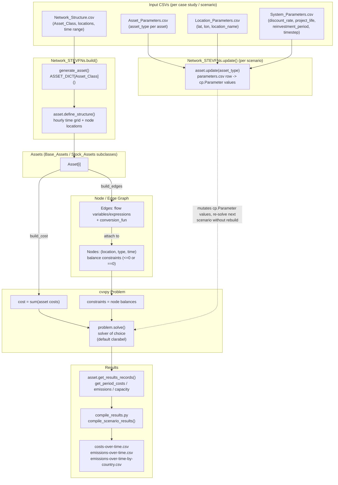

# Model Architecture
---

The core architecture is designed so for any one case study, the network structure (which
assets are available to install, where, and how many time steps should be sampled) is built once.
After it is built, scenarios with the same structure can be re-run by changing parameter values.

In other words, each row of `Network_Structure.csv` becomes an asset instance, which defines its hourly time grid and wires
itself into the shared node/edge graph, contributing one term to the total
system cost.

The `update()` method occurs once per scenario: parameter values (costs, profiles,
budgets) are pushed into the existing `cp.Parameter` objects — the graph structure itself doesn't change, so the same `Problem` can be re-solved
cheaply (computationally) scenario after scenario.

Finally, results for analysis are pulled back out per asset after solving, then compiled
into the long-format output CSVs. This current implementation follows result extraction formatted
for processing in the GMPA webtool for visualization. Tailored result extraction may be scripted
and applied for other pruposes.

