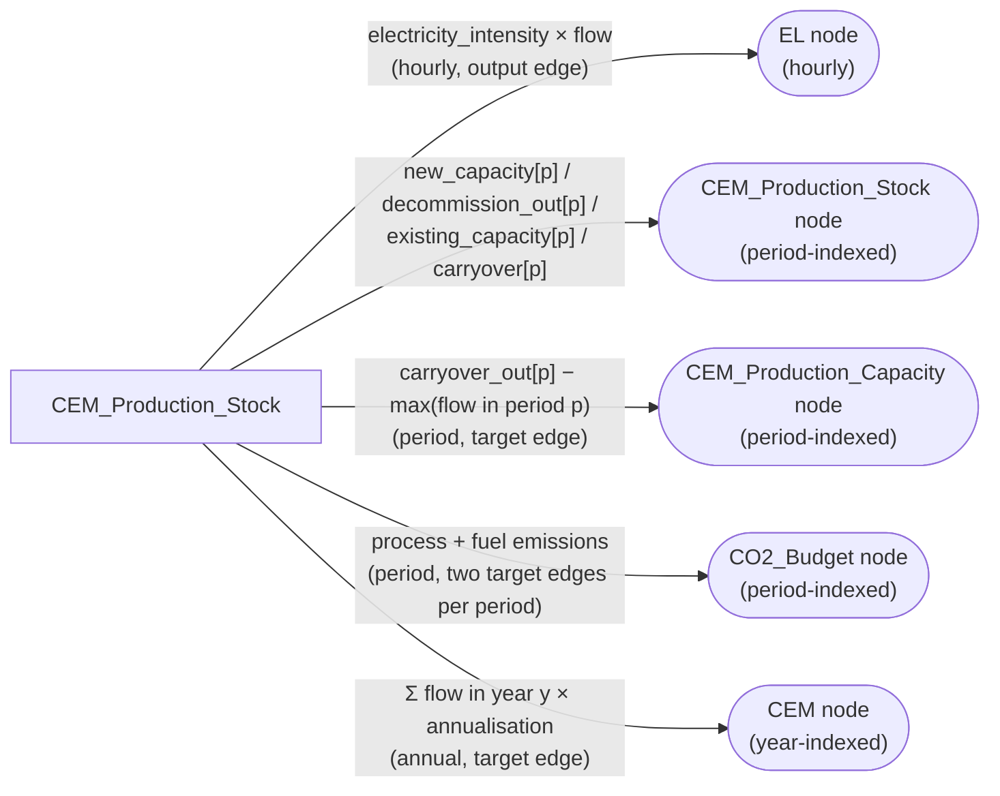

# STEVFNs Assets
---

An asset in STEVFNs may refer to a specific technology, or other component in
the energy system it aims to model. Each asset class is written as a Python module
under `src/assets/<asset_name>`.
This page outlines the formulation and key assumptions for the abstraction of the
components modelled in the GMPA. It is organised by sector, except for the CO~2~
budget asset, which is conceptualised as a system-wide asset.

## CO~2~ Budget
**Asset class**: `CO2_Budget_Asset`<br>
**Module**: `assets/CO2_Budget/co2_budget.py`<br>
**Base class**: `Asset_STEVFNs`<br>

## Power Sector


### BESS
**Asset class**: `BESS_Asset`<br>
**Module**: `assets/BESS/bess.py`<br>
**Base class**: `Stock_Asset_STEVFNs`<br>

### RE assets
**Asset class**: `RE_PV_Openfield_Lim_Asset`<br>
**Module**: `assets/RE_PV_Openfield_Lim/pv_openfield.py`<br>
**Base class**: `Stock_Asset_STEVFNs`<br>
!!! note
    Sample asset class and module for VRE assets. These include RE_PV_Rooftop_Lim, RE_WIND_Onshore_Lim, and RE_WIND_Offshore_Lim asset classes. 
    Assumptions and formulations for these are all equivalent to allow for options within optimisation

### Fossil generators
**Asset class**: `PP_CO2`<br>
**Module**: `assets/PP_CO2/pp_co2.py`<br>
**Base class**: `Stock_Asset_STEVFNs`<br>
!!! note
    Sample asset class and module for fossil generator assets. These include PP_COAL_CO2, PP_NGS_CCGT_CO2, PP_NGS_SCGT_CO2 and PP_OIL_CO2 asset classes. 
    Assumptions and formulations for these are all equivalent, parameter values change to allow for options within optimisation


## Industry Sector

### Cement demand
**Asset class**: `CEM_Demand_Asset`<br>
**Module**: `assets/CEM_Demand/cem_demand.py`<br>
**Base class**: `Asset_STEVFNs`<br>

Represents the annual cement consumption requirement at a location over the full
multi-decade model horizon.

This is intentionally the same granularity convention used for electricity demand
in the network: the investment decision (Cement Production options from different
technology types' new-build capacity) only changes at reinvestment-period boundaries,
but the resulting operating capacity must satisfy demand at the finer annual resolution
every year in between.

Governing assumptions<br>

1. No material balance is modelled (no explicit fuel, clinker etc. flow tracking). Demand
is a pure quantity requirement in Mt cement/year.
2. Demand is met with slack, not equality: the CEM node's default curtailment behaviour
allows production ≥ demand (overproduction is permitted, undersupply is not).
4. Demand values may come from either a full annual trajectory parameter (a CSV profile)
or a single value, broadcast across all modelled years (see demand input modes).

#### Network topology

Insert stevfns node-edge diagram

One output edge is built per year, each attached to the `CEM` node at
`node_time = year_number` (`year_number` runs `0 .. num_years - 1`,
where `num_years = project_life / 8760`). The edge's flow is simply
`demand_param[year_number]` — no conversion function is applied.

#### Parameters

| Parameter | Units | Description |
|---|---|---|
| `trajectory_filename` | string *or* float | See [Demand input modes](#demand-input-modes) below. |
| `case_study` | string | Required **only** when `trajectory_filename` is a profile name. Filters the trajectory CSV to this asset's case study. |

#### Demand input modes

`_load_demand_trajectory()` branches on the *type* of
`parameters_df["trajectory_filename"]`:

- **String** → treated as a profile filename. Loads
  `profiles/<trajectory_filename>.csv`, filters rows where
  `scenario_name == network.scenario_name` and
  `case_study == parameters_df["case_study"]`, and reads the `demand`
  column. Raises `ValueError` if the filtered row count doesn't equal
  `num_years`.
- **Float** → treated as a constant annual demand (Mt cement/year),
  broadcast identically across all `num_years` entries via
  `np.full(num_years, constant_demand)`. `case_study` is not required
  in this mode.

!!! warning "CSV value types"
    If a numeric value is written in quotes in `parameters.csv` (e.g.
    `"45.2"`), pandas will read it as a **string**, so it will be routed
    to the profile-lookup branch and fail when `+ ".csv"` is appended.
    Leave numeric demand values unquoted.

##### Trajectory CSV schema (profile mode)

| Column | Description |
|---|---|
| `scenario_name` | Must match the network's active scenario folder name. |
| `case_study` | Must match `parameters_df["case_study"]`. |
| `demand` | Mt cement/year. One row per year of `project_life` (not per reinvestment period). |

#### Reporting

`get_asset_sizes()` returns the full resolved `demand_param` array
(Mt cement/year, one value per year), keyed as
`CEM_Demand_Stock_location_<node_location>`.

### Cement production

#### Coal kiln
**Asset class**: `CEM_Production_Asset`<br>
**Module**: `assets/CEM_Production/cem_production.py`<br>
**Base class**: `Stock_Asset_STEVFNs`<br>

Multi-decade, stock-based **conventional (fuel-fired)** cement
production technology. Represents the combined milling + kiln process
line as a single priced technology — capital and usage costs are not
split between milling and kiln/HTH sub-components, matching the
project's convention that a "technology option" carries one bundled
cost rather than itemised equipment costs.

##### Governing assumptions

- **No material balance.** Ore, fuel, and clinker flows are not
  tracked explicitly; cost and emissions are captured entirely through
  intensity factors applied to the cement output flow.
- **One bundled technology cost.** A single `sizing_constant` (capex)
  and `usage_constant` (opex/fuel) per technology row, following
  `Stock_Asset_STEVFNs`'s shared `cost_fun`.
- **Two time granularities in play simultaneously:**
    - *Reinvestment-period* granularity for capacity investment
      (`new_capacity`, `carryover_out`) and for emissions reporting to
      the `CO2_Budget` node.
    - *Annual* granularity for matching supply against demand at the
      `CEM` node (see [Cement Demand](#cement-demand)).
    - *Hourly* granularity for electricity draw, since that has to
      interact with the hourly EL system.
- **Decommissioning** uses the same hard-lifetime mask as every other
  `Stock_Asset_STEVFNs` subclass, driven by `parameters_df["lifespan"]`
  via the inherited `_update_new_capacity_decom_mask()` /
  `_get_lifetime_periods()`.

###### Network topology



###### Edges built

| Edge group | Count | Granularity | Node | Direction |
|---|---|---|---|---|
| Electricity draw | `number_of_edges` (hourly) | hourly | `EL` | output (source) |
| Stock chain (install / decommission / existing / carryover) | 3–4 per period | period | `CEM_Production_Stock` | mixed |
| Capacity limit | `num_periods` | period | `CEM_Production_Capacity` | target |
| Annual production | `num_years` | **annual** | `CEM` | target |
| Process emissions | `num_periods` | period | `CO2_Budget` | target |
| Fuel emissions | `num_periods` | period | `CO2_Budget` | target |

Two edges (process + fuel) feed the *same* `CO2_Budget` node per
period; the node sums all input edges automatically, so the budget
constraint always sees the true combined total even though the two
components are tracked separately for reporting.

##### Parameters

| Parameter | Units | Description |
|---|---|---|
| `sizing_constant` | $/(Mt cement/yr) | Capex per unit of annual production capacity. Amortised via the shared NPV annuity pipeline (`_update_sizing_constant`). |
| `usage_constant` | $/Mt cement | Blended opex + fuel cost per unit cement produced. |
| `electricity_intensity` | GWh/Mt cement | Combined grinding/blending electricity draw. |
| `process_emissions_factor` | MtCO₂/Mt **clinker** | Calcination CO₂ per unit of clinker (not per unit of cement — see [Process emissions](#process-emissions)). |
| `clinker_to_cement_ratio` | Mt clinker/Mt cement (dimensionless) | Fraction of the cement output that is clinker; the remainder is supplementary cementitious material (SCM, e.g. fly ash, slag) that carries no process CO₂ in this model. |
| `fuel_emissions_factor` | MtCO₂/Mt cement | Combustion CO₂ from kiln fuel. |
| `lifespan` | hours | Economic/technical lifetime; drives the decommissioning mask (same convention as every `Stock_Asset_STEVFNs` subclass — years × 8760). |
| `interest_rate` | fraction | Used in the capital annuity calculation. |
| `existing_capacity` | Mt cement/yr | Pre-existing operating capacity at model start. |
| `existing_capacity_decay_rate` | fraction/period | Retention decay applied to `existing_capacity` (used when `decommission_mode = "decay_rate"`). |

###### Equations

####### Process emissions

Process (calcination) emissions are now factored through clinker
content rather than applied directly to the cement flow, since
calcination CO₂ is a property of clinker production, not of any SCM
blended in afterward:

```
E_process[p] = process_emissions_factor × clinker_to_cement_ratio × Σ(flow, period p) × annualisation_factor
```

This means two cement lines with identical `process_emissions_factor`
(same clinker chemistry) can report different emissions intensity per
unit of *cement* if they use different `clinker_to_cement_ratio` values
— e.g. a blended/low-clinker cement product has a lower reported
process intensity even on the same kiln technology.

###### Fuel emissions

```
E_fuel[p] = fuel_emissions_factor × Σ(flow, period p) × annualisation_factor
```

Applied directly to cement flow (no clinker adjustment) since it
represents combustion, not calcination chemistry.

###### Electricity draw (hourly)

```
EL_draw[t] = electricity_intensity × flow[t]
```

Pre-multiplied into the edge flow directly (rather than left to an
edge `conversion_fun`) since this edge has no target node — a
target-less output edge's flow is used as-is in the node balance, and
`conversion_fun` is only ever applied on the *target* side.

###### Capacity constraint (period)

```
carryover_out[p] ≥ max(flow[t] for t in period p)
```

Enforced via a target-only edge into `CEM_Production_Capacity[p]`
whose flow is `carryover_out[p] - max(period_flows)`; the node's
default curtailment behaviour (`net_output_flows ≤ 0`) forces this to
be non-negative.

###### Annual production vs. demand (year)

```
cement_supplied[y] = Σ(flow[t] for t in year y) × annualisation_factor
```

Fed into the `CEM` node at `node_time = y`. Demand is met with slack
(`cement_supplied[y] ≥ demand[y]`), not equality — see
[Cement Demand](#cement-demand).

####### Annualisation factor

```
annualisation_factor = 365 / sampled_days_per_year
```

where `sampled_days_per_year = (number_of_edges / 24) / num_years`.
Applied per-year for the production edge (correctly scales one year's
sample to a full 365-day year) and per-period for the two emissions
edges (period sums, still using the per-year day count, consistent
with the existing `CO2_Budget` convention).

####### Cost

Uses the shared `Stock_Asset_STEVFNs.cost_fun` unmodified:

```
cost = Σ(sizing_constant_matrix @ new_capacity) + Σ(usage_constant × flow)
```

##### Reporting metrics

| Metric | Unit | Source |
|---|---|---|
| `cost` | Billion USD | Inherited `get_period_costs()` (capital + usage, period-indexed). |
| `emissions` | MtCO2e | `get_period_emissions()` = process + fuel, period-indexed. |
| `capacity` | Mt cement/yr | `get_period_capacity()` → operating stock (`carryover_out`), period-indexed. |

All metrics reported through `get_results_records()` are
reinvestment-period-indexed (`year = start_year + period_index ×
reinvestment_period_years`), even though the underlying production/
demand balance now operates at annual granularity — the finer-grained
`get_annual_production()` values are available on the asset object but
are not currently surfaced through the results compiler's schema.

#### Electric kiln
**Asset class**: `CEM_Production_EL_Asset`<br>
**Module**: `assets/CEM_Production_EL/cem_production_el.py`<br>
**Base class**: `Stock_Asset_STEVFNs`<br>


## Transport Sector


