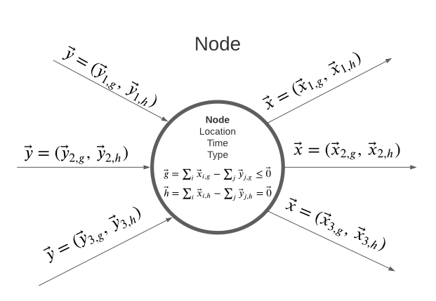

# Generalised Asset Model Formulation
---

The Space-Time-Energy Vector Flow Networks (STEVFNs, pronounced _"stevens"_) is a generalised
model generator. Originally developed to model energy systems, it models systems as
directed flow networks, solved as a single convex optimisation problem: minimise total
system cost subject to conservation-of-flow constraints at every node.
The original theoretical background and formulation can be consulted at:

!!! abstract "STEVFNs Formulation"
    [Ahsan, A. 2022. _“Generalized Spatio-Temporal Model for the Optimal Sizing, Operation, and Location of Energy System Assets.”_
    PhD thesis, University of Oxford.](https://ora.ox.ac.uk/objects/uuid:fc64231e-524e-433f-9b32-b9ffe5b5f974)


The framework relies on the open-source [CVXPY library](https://www.cvxpy.org/api_reference/cvxpy.expressions.html)
to build the convex optimisation problem. 

The following sections will describe the key definitions for model setup.

## Nodes

A node is uniquely identified by a **(location, type, time)** tuple, e.g.
`(3, "EL", 120)` node type "EL" (this refers to the grid, conventionally) at location 3, and hour 120.

- `Network_STEVFNs.nodes_df` is a `pandas.Series` indexed by this tuple,
  holding one `Node_STEVFNs` object each. `extract_node(location, type, time)`
  looks up an existing node or lazily creates one.
- Each node accumulates a set of `input_edges` and `output_edges`.
- Balance constraint (`Node_STEVFNs.build_constraints`):
Explicit problem constraints are defined at the node level; the assets are designed so that at each problem node, 
the net output flows are calculated:

  ```
  net_output_flows = total_output_flows - total_input_flows
  ```
There are two kinds of explicit constraints:

  - If node `curtailment = True` (default) -> `net_output_flows <= 0`:
  node output flows may exceed what's needed (surplus can be wasted/curtailed),
    but the node can never be short of inputs.
  - If node `curtailment = False` -> `net_output_flows == 0`:
    a hard equality balance (used e.g. for capacity "stock" nodes, where
    nothing may be silently dropped).

Input edges are summed via `extract_flow()`, which passes the edge's raw flow
through the edge's `conversion_fun` first (e.g. applying an efficiency loss or
turning a fossil generation flow into a CO~2~e emissions flow) before it hits the node balance.

{ width="400" }
/// caption
**Diagram of a STEVFNS node**: Identity of a node is defined by three values: location, time and type.
Node may contain two pieces of information: an inequality constraint function
(curtailment = True), $\vec{g}$, or an equality constraint function (curtailment = True),
$\vec{h}$. Multiple input and output edges may be contected to a given node, while the net
output flows are what holds the constraint.
///


## Edges

`Edge_STEVFNs` is a directed edge from a source node to a target node,
carrying:
- `flow`: a cvxpy expression (`Variable`, `Parameter`, `Constant` or other derived expression)
- `conversion_fun` / `conversion_fun_params`: applied when the flow enters
  its target node (if any conversion should be applied, e.g. by an efficiency or converting
  energy to emissions via emissions factor parameters)

Edges and their flows are the only things that actually appear in the optimisation problem's
constraints. Assets are just _"factories"_ that build sets of edges between nodes aiming to simulate their
physical operation, and a cost.

## Assets

`Asset_STEVFNs` is the base class every technology (PV, dispatchable
generator, transport line, demand, CO2 budget, storage, ...) inherits from.

**Lifecycle per asset:**
1. `define_structure(asset_structure)`: reads a row of `Network_Structure.csv`
   (`Location_1`, `Location_2`, `Start_Time`, `End_Time`, `Period`) and sets
   up the hourly time grid (`source_node_times`, `target_node_times`) plus
   `self.flows` (defaults to a zero `cp.Constant` array, one entry per
   sampled hourly timestep. This is overridden by subclasses that need a real
   decision variable or a parameter).
2. `update(asset_type)`: loads a row from that asset's `parameters.csv`
   (filtered by `asset_type`) and assigns numeric values into every
   `cp.Parameter` in `cost_fun_params` / `conversion_fun_params` relevant to that asset.
3. `build()` = `build_edges()` + `build_cost()`:
   - `build_edges()` creates one `Edge_STEVFNs` per sampled timestep, wiring
     `flows[i]` between `(source_node_location, source_node_type, time[i])`
     and `(target_node_location, target_node_type, time[i])`.
   - `build_cost()` = `cost_fun(flows, cost_fun_params)`, a scalar cvxpy
     expression.

`source_node_type` / `target_node_type` of `"NULL"` mean that side of the
asset isn't attached to a node at all (e.g. a pure source or sink without a constraint).

The subclasses, i.e. each technology modelled, will have overrides or build additional edges
depending on design decisions. For example, renewable assets with a suffix "Lim" are designed 
to have a maximum capacity constraint.
The asset then builds an edge from a "NULL" type node to a capacity node with the conversion function
`maximum_technical_capacity - installed_capacity`. The capacity node therefore only has that input edge flow,
leading to 
```
net_output_flows = -input_flows
net_output_flows = installed_capacity - maximum_technical_capacity <= 0
installed_capacity <= maximum_technical_capacity
```
This follows the general node-edge formulation and allows the setting of additional constraints via node balance.

### Multi_Asset

`Multi_Asset` composes several sub-assets (or components) over the same `asset_structure`
(e.g. a technology bundle). It fans out `define_structure` / `update` /
`build` to each child asset in `assets_dictionary`, and its own `cost_fun`
combines the children's costs (default: 0, i.e. subclasses define how
sub-costs combine).

## Network assembly and solve

`Network_STEVFNs.build(network_structure_df)`:

1. Instantiates one asset per row of `Network_Structure.csv` via
   `generate_asset` → `ASSET_DICT[Asset_Class]()`.
2. `build_problem()`:
   - `build_assets()` — calls `build()` on every asset, collecting each
     asset's `cost` into `self.costs`.
   - `build_system_structure_properties()` — records the simulated hourly
     span.
   - `build_cost()` — `self.cost = cp.sum(self.costs)` (system objective).
   - `build_constraints()` — builds every node's balance constraint and
     collects them into `self.constraints`.
   - Assembles `cp.Problem(cp.Minimize(self.cost), self.constraints)`.

`Network_STEVFNs.update(...)` pushes new parameter values (location lat/lon,
per-asset `asset_type`, system parameters) into the already-built graph
without rebuilding its structure, so the same `Problem` object can be
re-solved scenario after scenario (`update_problem()` only needs to rebuild
constraints, since parameters are mutated in place).

`solve_problem()` / `main.py` then calls `problem.solve(...)` with a chosen
solver (ECOS / CLARABEL / MOSEK).

!!! note
    Consult [CVXPY's documentation](https://www.cvxpy.org/tutorial/solvers/index.html) on solver options
    if a specific solver is required to use in my_network.problem.solve() in STEVFNs main.py. Default is open-source
    CLARABEL, but CVXPY enables use of various open-source and proprietary solvers.

## General results extraction

Every asset exposes a common getter interface (defaults return `None`,
overridden where relevant):

- `get_period_costs()`     → per-reinvestment-period annualised cost (Billion USD)
- `get_period_emissions()` → per-period annualised emissions (MtCO~2~e)
- `get_period_capacity()`  → per-period installed/operating capacity

`get_results_records()` turns these into long-format rows
(`country, year, technology, metric, unit, value`), and
`compile_results.py` walks every asset in a solved network to build the
scenario's full results table.

## In summary

```
Network_Structure.csv  →  one Asset per row
                            │
                 define_structure()  → hourly time grid, node locations
                 update(asset_type)  → parameters.csv row → cp.Parameter values
                 build()             → Edges (flow variables/expressions)
                                        + Cost (cvxpy scalar)
                            │
        Nodes (location, type, time) accumulate input/output edges
                            │
              Node balance constraints (<=0 or ==0)
                            │
     Problem = Minimize(sum of all asset costs) s.t. all node balances
                            │
                         solve()
```
